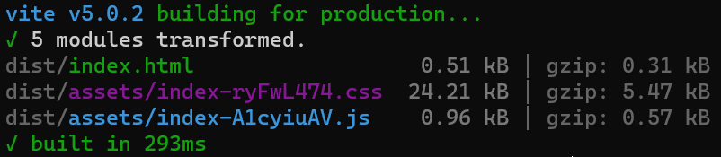

# :tada:vite-plugin-cesium-build

English | [简体中文](/README.zh-CN.md)

It externalizes `Cesium.js` and automatically copies the four major libraries and core files of CesiumJS during the build process.

- :+1: **DX** Zero impact on development
- :sparkles: **TypeScript** Type support.
- :rocket: **Super fast!** In my laptop, the sample project only takes 300ms to complete the build because the Cesium library is not involved in the core build.



## :memo: Usage

Install this plugin

```sh
pnpm add -D vite-plugin-cesium-build
```

Import it in `vite.config.js`

```javascript
import { defineConfig } from 'vite'
import cesium from 'vite-plugin-cesium-build'

export default defineConfig({
  plugins: [
    //...
    cesium()
  ]
})
```

Done? Yes, that's it! You have completed the entire configuration for CesiumJS! Now you can continue development and build as usual!  
For those familiar with CesiumJS, you may wonder where to configure `window.CESIUM_BASE_URL`. In fact, this operation is also automatically handled by the plugin.

```javascript
// Customize variable 'to' in options
Object.defineProperty(globalThis, 'CESIUM_BASE_URL', {
  value: '/${to}/'
})
```

This plugin will add the code above to your `index.html`  

## :wrench: Options

In addition, the plugin provides some configuration options:

```javascript
export default defineConfig({
  plugins: [
    cesium({
      /**
       * Specifies the location of the Cesium package folder
       * Which means the relevant resources of CesiumJS will be obtained from this folder
       */
      from: 'node_modules/cesium/Build/Cesium',

      /**
       * Specifies the location of the built resources
       * Which means the built resources will be placed under /dist/cesium-package/
       */
      to: 'cesium-package'
      
      /**
       * If `true`, you need to manually set the CESIUM_BASE_URL.
       */
      customCesiumBaseUrl: false
    })
  ]
})
```
